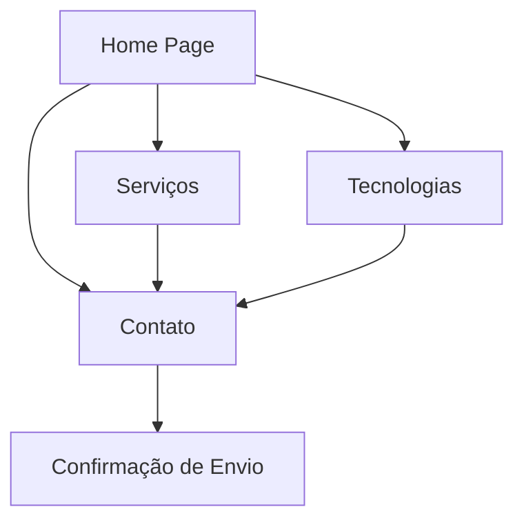

## 1. Product Overview
O Automase é uma consultoria de tecnologia especializada em soluções empresariais, desde Salesforce até desenvolvimento em diversas linguagens. O site serve como porta de entrada para atrair clientes que buscam soluções tecnológicas de ponta e serviços de consultoria especializada.

O público-alvo são empresas e profissionais que necessitam de transformação digital, automação de processos e desenvolvimento de soluções tecnológicas customizadas. O site deve transmitir excelência técnica e inovação através de um design extremamente moderno e animações impactantes.

## 2. Core Features

### 2.1 User Roles
| Role | Registration Method | Core Permissions |
|------|---------------------|------------------|
| Visitor | No registration required | Browse all content, submit contact forms |
| Potential Client | Contact form submission | Receive proposals, schedule consultations |
| Newsletter Subscriber | Email subscription | Receive updates and technical content |

### 2.2 Feature Module
O site da Automase consiste nas seguintes páginas principais:
1. **Home page**: hero section com animações 3D, apresentação de serviços, tecnologias, cases de sucesso e formulário de contato.
2. **Serviços**: detalhamento de cada serviço oferecido com animações interativas e demonstrações visuais.
3. **Tecnologias**: showcase visual das tecnologias trabalhadas com animações e efeitos hover elaborados.
4. **Contato**: formulário interativo com validação em tempo real e integração com sistemas de CRM.

### 2.3 Page Details
| Page Name | Module Name | Feature description |
|-----------|-------------|---------------------|
| Home page | Hero Section | Apresentação inicial com animação 3D de partículas, texto animado com efeito typewriter, botões com hover effects elaborados e background com gradientes animados. |
| Home page | Navigation | Menu fixo com efeito glassmorphism, animações suaves ao scroll, indicadores visuais de seção ativa e responsividade total. |
| Home page | Services Showcase | Cards de serviços com animações 3D no hover, ícones animados, transições suaves e efeitos parallax. |
| Home page | Technology Stack | Grid animado das tecnologias com logos flutuantes, efeitos de brilho e animações de rotação suave. |
| Home page | Success Cases | Carrossel de cases com animações de transição, depoimentos com efeito fade-in, métricas animadas com contador. |
| Home page | Contact CTA | Seção de call-to-action com animação pulsante, formulário simplificado e efeitos de brilho. |
| Serviços | Service Details | Página individual para cada serviço com animações de entrada, diagramas interativos e processo de trabalho animado. |
| Serviços | Pricing Cards | Cards de preços com animações hover, comparação visual de features e botões com efeitos elaborados. |
| Tecnologias | Tech Gallery | Galeria animada com filtros interativos, efeitos de zoom suave e animações de categoria. |
| Tecnologias | Expertise Level | Barras de progresso animadas, certificações com efeitos de conquista e timeline de experiência. |
| Contato | Contact Form | Formulário multi-etapas com validação em tempo real, animações de campo, efeitos de sucesso e integração com WhatsApp. |
| Contato | Location Map | Mapa interativo com animação de pin, informações de contato com efeitos hover e horários animados. |

## 3. Core Process
O fluxo principal do usuário começa na Home page, onde o visitante é impactado pelas animações extravagantes e apresentação visual dos serviços. O usuário pode navegar para a página de Serviços para entender melhor as ofertas, explorar as Tecnologias utilizadas e finalmente entrar em contato através do formulário interativo.

O design deve criar uma experiência memorável que demonstre a expertise técnica da Automase através de interações visuais impressionantes e animações fluidas que guiam o usuário naturalmente através do conteúdo.

## 4. User Interface Design

### 4.1 Design Style
- **Cores Primárias**: Gradiente de azul elétrico (#00D4FF) para roxo vibrante (#7B2FFF) com acentos em neon verde (#39FF14)
- **Cores Secundárias**: Preto profundo (#0A0A0A), cinza metálico (#1A1A1A) e branco gelo (#F5F5F5)
- **Botões**: Estilo glassmorphism com bordas neon, efeitos de brilho no hover e animações de pulsação
- **Tipografia**: Fonte futurista como "Orbitron" para títulos, "Inter" para texto corrido, tamanhos grandes e impactantes
- **Layout**: Baseado em cards flutuantes com efeitos de profundidade, grid assimétrico e espaçamento generoso
- **Ícones**: Estilo line-art com animações de traçado, efeitos de brilho e estilo tech-futurista

### 4.2 Page Design Overview
| Page Name | Module Name | UI Elements |
|-----------|-------------|-------------|
| Home page | Hero Section | Background com partículas 3D animadas, texto principal com efeito glitch e neon, CTA buttons com aura glow, scroll indicator animado. |
| Home page | Services | Cards flutuantes com efeito levitação, ícones 3D rotativos, hover effects com transformações complexas e micro-animações. |
| Home page | Tech Stack | Logo parade com efeito carousel 3D, animações de flutuação individualizadas, efeitos de reflexo e brilho dinâmico. |
| Serviços | Header | Título com animação de máquina de escrever, subtítulo com efeito fade-in escalonado, breadcrumb animado. |
| Serviços | Content | Accordion animado com easing curves, imagens com lazy loading efeitos, diagramas com animações de SVG path. |
| Contato | Form | Campos com bordas animadas, labels flutuantes, validação visual com ícones animados, submit button com loading states. |

### 4.3 Responsiveness
Desktop-first com adaptação mobile completa. O site prioriza a experiência desktop para demonstrar todo o potencial das animações 3D e efeitos visuais. Mobile mantém a essência do design com animações simplificadas e touch-optimized interactions, garantindo performance fluida em dispositivos móveis.

### 4.4 Animações e Interações
- **Scroll-triggered animations**: Cada seção revela conteúdo com animações únicas baseadas no scroll position
- **Mouse-tracking effects**: Elementos que respondem ao movimento do mouse criando profundidade e imersão
- **WebGL particles**: Sistema de partículas 3D para background e efeitos visuais extraordinários
- **Staggered animations**: Sequências de animações que criam ritmo visual e guiam a atenção do usuário
- **Morphing shapes**: Formas SVG que se transformam suavemente durante a navegação
- **Parallax layers**: Múltiplas camadas com velocidades diferentes criando sensação de profundidade
- **Loading animations**: Transições criativas entre páginas com efeitos de distorção e fade