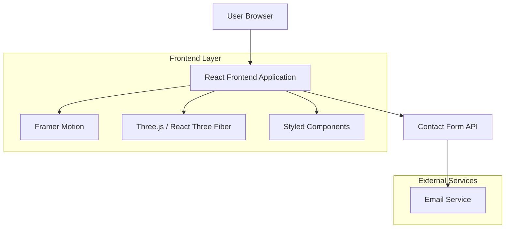

## 1. Architecture design



## 2. Technology Description

- Frontend: React@18 + Vite + TypeScript
- Initialization Tool: vite-init
- Styling: Styled Components + Tailwind CSS
- Animations: Framer Motion + GSAP
- 3D Graphics: Three.js + @react-three/fiber + @react-three/drei
- Forms: React Hook Form + Yup validation
- Icons: React Icons + Custom SVG animations
- Backend: None (frontend-only com integração de serviços externos)

## 3. Route definitions

| Route | Purpose |
|-------|---------|
| / | Home page com hero section animada e showcase de serviços |
| /servicos | Página de serviços com detalhamento e animações interativas |
| /tecnologias | Showcase visual das tecnologias com efeitos 3D |
| /contato | Formulário de contato interativo com validação em tempo real |

## 4. Component Architecture

### 4.1 Core Components Structure
```typescript
// Exemplo de estrutura de componente animado
interface AnimatedSectionProps {
  children: React.ReactNode;
  animationType: 'fadeIn' | 'slideUp' | 'scaleIn';
  delay?: number;
  duration?: number;
}

interface ServiceCardProps {
  title: string;
  description: string;
  icon: React.ReactNode;
  color: string;
  animationDelay: number;
}

interface ContactFormData {
  name: string;
  email: string;
  company: string;
  message: string;
  service: string;
}
```

### 4.2 Animation System
```typescript
// Configurações de animação padrão
const animationVariants = {
  hidden: { opacity: 0, y: 50 },
  visible: {
    opacity: 1,
    y: 0,
    transition: {
      duration: 0.8,
      ease: "easeOut"
    }
  }
};

const hoverVariants = {
  rest: { scale: 1 },
  hover: {
    scale: 1.05,
    transition: {
      duration: 0.3,
      ease: "easeInOut"
    }
  }
};
```

## 5. 3D Scene Implementation

### 5.1 Particle System Configuration
```typescript
// Configuração do sistema de partículas 3D
interface ParticleConfig {
  count: number;
  size: number;
  speed: number;
  color: string;
  opacity: number;
  connectionDistance: number;
}

// Componente de partículas para background
const ParticleField: React.FC<ParticleConfig> = ({
  count = 1000,
  size = 0.005,
  speed = 0.001,
  color = "#00D4FF",
  opacity = 0.6
}) => {
  // Implementação com react-three-fiber
}
```

### 5.2 Interactive 3D Elements
```typescript
// Componente de logo 3D animado
interface AnimatedLogo3DProps {
  rotationSpeed: number;
  scale: number;
  colorGradient: [string, string];
  interactive: boolean;
}

// Efeitos de mouse tracking
const useMouseTracking = () => {
  const [mousePosition, setMousePosition] = useState({ x: 0, y: 0 });
  
  useEffect(() => {
    const handleMouseMove = (e: MouseEvent) => {
      setMousePosition({
        x: (e.clientX / window.innerWidth) * 2 - 1,
        y: -(e.clientY / window.innerHeight) * 2 + 1
      });
    };
    
    window.addEventListener('mousemove', handleMouseMove);
    return () => window.removeEventListener('mousemove', handleMouseMove);
  }, []);
  
  return mousePosition;
};
```

## 6. Performance Optimization

### 6.1 Animation Performance
- Uso de `will-change` CSS para elementos animados
- Implementação de `requestAnimationFrame` para animações complexas
- Lazy loading de componentes 3D pesados
- Memoização de componentes com React.memo
- Virtualização de listas longas quando aplicável

### 6.2 Asset Optimization
- Imagens em formato WebP com fallbacks
- SVG otimizados para ícones e logos
- Fontes com preload e display swap
- Code splitting por rotas
- Bundle size optimization com tree shaking

## 7. Integration Guidelines

### 7.1 Contact Form Integration
```typescript
// Integração com serviço de email
const submitContactForm = async (data: ContactFormData) => {
  try {
    const response = await fetch('/api/contact', {
      method: 'POST',
      headers: { 'Content-Type': 'application/json' },
      body: JSON.stringify(data)
    });
    
    if (response.ok) {
      // Animação de sucesso
      showSuccessAnimation();
    }
  } catch (error) {
    // Animação de erro
    showErrorAnimation();
  }
};
```

### 7.2 Analytics Integration
- Google Analytics 4 para tracking de eventos
- Hotjar para heatmaps e gravações de sessão
- Custom events para tracking de interações específicas
- Performance monitoring com Web Vitals

## 8. Development Workflow

### 8.1 Project Structure
```
src/
├── components/
│   ├── ui/
│   ├── sections/
│   ├── 3d/
│   └── animations/
├── hooks/
├── utils/
├── styles/
├── assets/
└── types/
```

### 8.2 Build Configuration
- Vite com hot reload otimizado
- TypeScript strict mode habilitado
- ESLint e Prettier para code quality
- Husky para pre-commit hooks
- Jest + React Testing Library para testes